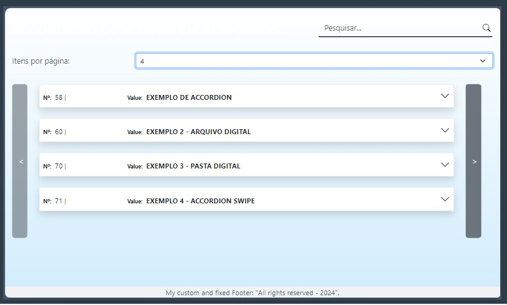

# Swipe Accordions

## Overview
Swipe Accordions is a simple and dynamic accordion carousel system, designed to navigate content smoothly. It combines the simplicity of accordions with the flexibility of a carousel, enabling you to swipe through accordion items effortlessly.

## Features
- **Responsive Navigation**: Easily navigate between accordion items using carousel buttons on the sides.
- **Customizable Pagination**: Choose how many items you want to display per page.
- **Smooth Transition**: Items are displayed with a smooth transition effect.

## How to Use
1. **Download or Clone**: Get the project files from the repository.
2. **Set Up**: Use the provided HTML, CSS, and JavaScript files.
3. **Customization**: Adjust the number of items per page via the dropdown menu.

## License
This project is licensed under the MIT License. See the [LICENSE](LICENSE) file for more details.

---

## Accordions de Swipe

### Visão Geral
Swipe Accordions é um sistema de carrossel de acordeões simples e dinâmico, projetado para navegar pelo conteúdo de forma suave. Ele combina a simplicidade dos acordeões com a flexibilidade de um carrossel, permitindo que você deslize facilmente entre os itens do acordeão.

### Funcionalidades
- **Navegação Responsiva**: Navegue facilmente entre os itens do acordeão usando botões de carrossel nas laterais.
- **Paginação Personalizável**: Escolha quantos itens deseja exibir por página.
- **Transição Suave**: Os itens são exibidos com um efeito de transição suave.

### Como Usar
1. **Baixar ou Clonar**: Obtenha os arquivos do projeto no repositório.
2. **Configuração**: Use os arquivos HTML, CSS e JavaScript fornecidos.
3. **Personalização**: Ajuste o número de itens por página através do menu suspenso.

### Licença
Este projeto é licenciado sob a Licença MIT. Consulte o arquivo [LICENSE](LICENSE) para mais detalhes.

---

**Screenshot da Aplicação**:

